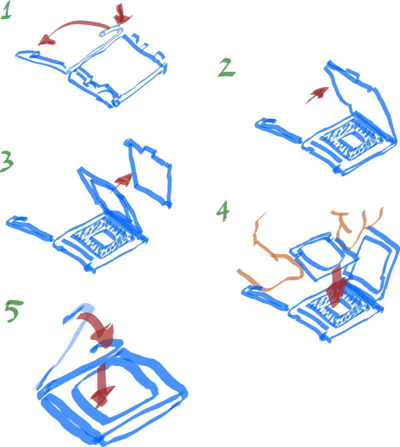
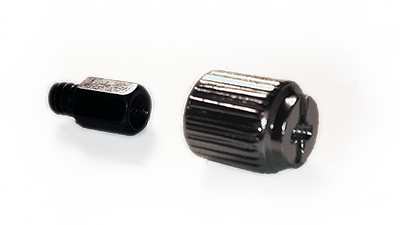

Como Fazer seu PC
=================

***ATENÇÃO***

***O texto a seguir ainda está em constante evolução.***

***Quando atingir versão adequada irei alterar essa mensagem.***

***Quando o texto estiver maduro, a idéia é que seja destinado ao público
leigo ou curioso que esteja interessado em construir um PC mas não sabe como
começar e precisa entender os passos envolvidos***

***Faltam referências para todo o texto***

#Introdução

O texto desse documento busca ser introdutório a atividade de montar o seu
próprio computador, o *Personal Computer*, seu PC. Em pontos definidos irei
detalhar a tecnologia corrente, porém tentarei manter o texto principal o mais
independente de nomenclaturas que se alterem muito rapidamente, focando em
conceitos que espero que estejam aí por muitos anos.

Esse texto é um guia básico e introdutório, não me responsabilizo por qualquer
dano que venha a ser causado em peças ou acidentes. Use esse guia como um norte,
mas faça sua própria pesquisa.

Se quiser montar seu computador, mas estiver muito inseguro, mesmo após ler esse
texto e outras fontes, ver vídeos sobre o tópico e se informar sobre o assunto,
pergunte as pessoas que você conhece. É provável que conheça alguém, ou conheça
alguém que conheça alguém, que possa lhe contar a experiência ou até mesmo
acompanhar na etapa de montagem - a mais assustadora para quem nunca o fez.
Existem também fórums e grupos online onde as pessoas podem ajudar desde que
você leia antes as regras de conduta e aja de acordo.

##Sobre a organização do texto.

Ao final de cada capítulo irei indicar com a chamada  **Sendo prático...**, onde
irei me referir a nomenclaturas correntes e as tecnologias sendo utilizadas.
Tenha em mente que a cópia obtida desse texto pode estar defasada e as
observações podem não ser apropriadas.

Siglas : ainda que o texto esteja em português (brasileiro), as siglas de
termos técnicos e peças usualmente estarão em inglês para facilitar a busca
online e por serem mais utilizadas que variantes em português. Ex: usarei OS
(*Operating System*) no lugar de SO quando me referir ao sistema operacional.

##Uso do Computador

Um computador não existe no vácuo, ele deve existir para atender um uso e ser
construído com esse uso em mente. Se não houver um uso específico ele deve ser
construído de forma simples e expansível, tendo em mente que pode ser necessário
até mesmo vendê-lo mais a frente para buscar o pc ideal ao seu uso.

O computador pode ser construído para navegar na internet e produzir textos,
edição de imagens, edição de vídeo, jogos casuais, jogos pesados e competitivos,
um servidor de arquivos pessoal, ou até mesmo executar pesadas simulações. Você
pode estar construindo um computador para servir um propósito específico ou uma
combinação dos propósitos anteriores. Definido a que se aplicará o computador é
importante levantar os softwares que deseja executar para atender esses
propósitos e consultar seus requerimentos de sistema mínimos e recomendados.

Por último, mas não menos importante, é necessário definir a verba que deseja
dedicar ao projeto. É importante lembrar que o computador desktop alem das peças
internas, terá o custo do gabinete, assim como de mouse, teclados e monitor, que
podem ser custos escondidos - e as vezes, um bom monitor e teclado podem ser as
peças mais caras do PC, além de afetarem sua percepção de qualidade uma vez que
estará utilizando-as para interagir com o computador diariamente. Esse guia se
limitará a discutir as peças internas e o gabinete.

#Seleção de peças

Se há um universo de todas possíveis peças, cada vez que você selecionar uma
para ser parte do seu computador, você estará restringindo as possibilidades
para as peças que não selecionou ainda. Nesse guia é feita a proposição da
seleção a partir do processador, e uma sequência arbitrária de escolha de peças.
Você pode proceder a seleção da forma que desejar, desde que satisfaça as
condições limites de cada peça.

##Processador

O processador (CPU) é o cérebro do computador, é o responsável por executar os
softwares e sua tecnologia usualmente irá definir boa parte dos recursos que
podem estar disponíveis pela placa mãe.

O processador também é uma das peças de maior consumo elétrico no computador -
junto da placa de vídeo. Isso pode ser relevante ou não na construção dependendo
das prioridades de uso do PC, por exemplo, maior consumo resulta em maior
potência dissipada no processador, que resulta em maior aquecimento, sendo
necessária uma melhor solução de resfriamento que pode tornar maior o tamanho do
PC ou mais barulhento em certos casos.

Um processador para uso em jogos usualmente terá quatro núcleos, e será das
gerações mais recentes, da família mais recente. No momento a maioria dos jogos
não fazem grande uso de processamento paralelo na CPU, de forma que um número
maior de núcleos pode não ser necessário, sendo mais indicado em aplicações de
multi processamento intensivo (como renderização 3D ou codificação de vídeo).

Já um uso simples de acesso a internet, produção textual, jogos modestos ou um
servidor doméstico apenas de arquivos, já será suficiente apenas dois núcleos -
mas se possível pegue um com a tecnologia multithread, que ajudará a aproveitar
melhor os dois núcleos. Ainda assim, é notável que uma maior frequência de
processamento usualmente trará maior capacidade de processamento e maior gasto
de energia - isso é relativo no entanto uma vez que processadores mais recentes
fazem mais coisas ao mesmo tempo e assim conseguem ser mais eficientes.

De maneira simplificada, o custo do processador tende a ser menor quanto mais
tempo ele está disponível no mercado, e quanto maior a demanda enquanto a oferta
estiver sendo levemente superior. Existem websites que armazenam e comparam
*benchmarks* de CPUs e podem ajudar a verificar se uma diferença de preço ou
consumo é justificada em desempenho.

**Sendo prático...**

* Para jogos leves, um processador i3 e uma placa de vídeo de jogos simples irá
atender.
* Para jogos pesados busque um i5 e uma placa de vídeo de jogos próxima das
últimas lançadas.
* Para edição de vídeo, processamento matemático intensivo, renderização de
gráficos de softwares CAD, um bom processador i7. Uma placa de vídeo para uso em
*workstations* pode ser interessante.
* Para uso com textos, acesso a internet, ou um pequeno servidor de arquivos
local um i3 com a placa de vídeo interna atenderá sem problemas.
* Processadores AMD podem ser interessantes caso se deseje obter um menor custo,
porém usualmente tem um consumo de energia superior, sendo menos eficientes.
* É aguardada uma nova geração de processadores AMD no momento que deve trazer
mais competitividade a marca.
* Existem outros processadores além de AMD e Intel, inclusive que não utilizem
arquitetura baseada x86, porém não são escopo desse texto.

* Um website de comparação de CPUs que pode-se utilizar é o
[CPU Benchmark](https://www.cpubenchmark.net/).

##Placa mãe

Uma placa mãe é construída para ser compatível com um grupo de processadores de
um fabricante. Ao selecionar a placa mãe é necessário verificar se o *socket* do
processador é compatível com a placa mãe (possuem o mesmo nome, ex: 2011-v3,
LGA 1151, ...).

O componente mais importante da placa mãe é o chipset, ele ditará os limites da
Placa Mãe, como memória RAM suportada, e também pode fornecer funcionalidades
como portas USB 3.0 e outros. O chipset deve ser compatível com o processador.
O conhecimento do chipset também irá permitir comparar placas mãe mais
facilmente, e encontrar oportunidades onde uma placa mãe está disponível por um
preço atraente ao comparar com outras similares.

Se pretende aproveitar alguma peça na sua placa mãe que já tenha além do
processor, verifique sua compatibilidade - para alguns componentes, como memória
RAM e SSDs, normalmente há uma lista de compatibilidade disponível para download
no website do fabricante. Se seu processador escolhido possuir uma placa de
vídeo interna, é interessante observar a disponibilidade de saídas de vídeo na
placa mãe sem requerir uma placa de vídeo dedicada.

 **Sendo prático...**

 * Para processadores Intel, no website ARK, os chipsets compatíveis são
 listados para cada processador, no item *Compatible Products*.

 * Para processadores AMD, no website da AMD é listado o soquete (socket AM3+,
 etc)  por processador e por chipset, certifique que sejam idênticos. Além disso
 será necessário verificar se o TDP (potência em W) da placa mãe é suficiente,
 informação disponível no website do fabricante.

##Pente de Memoria Ram

Os limites da memória RAM são definidos pela placa mãe e pela cpu, definindo
tecnologia, frequência e quantidade máxima de memória RAM em bytes.

Um número de bytes maior concentrado em um número menor de pentes de memória
possibilitam que o sistema possa ser expandido futuramente sem perder os pentes
existentes.

É recomendado verificar no site do fabricante da placa mãe se o pente de memória
está entre os de uso aprovado. Caso não esteja, a memória pode não funcionar, ou
apresentar falhas apenas em uso extremo. Pode também funcionar, mas realmente só
será verificada no uso.

**Sendo prático...**

*  em geral é interessante ter um número par de pentes para se beneficiar da
tecnologia *dual channel*. Algumas placas mães para entusiastas permitem uso de
*triple channel*, sendo necessário pentes em múltiplos de três.
* A tecnologia disponível nos processadores mais usuais é a memória DDR3 e DDR4,
com a memória DDR2 apenas em computadores antigos - mas ainda funcionais.
* É comum já ver a memória DDR5 em placas de vídeo porém não ainda em
computadores.
* Para a maioria das aplicações, um total de 8 GB de RAM já será suficiente,
a exceção sendo atividades de simulação e edição de vídeo e imagens em alta
resolução.

##Armazenamento

Armazenamento de dados em grande quantidade ficou barato em tempos recentes, e
combinado ao uso de serviços on-line a necessidade de grande volume de arquivos
locais foi reduzida. Hoje ao considerar armazenamento é importante também
considerar a velocidade de acesso e qualidade do armazenamento - e em alguns
casos até mesmo a confiabilidade.

Hoje as mídias de armazenamento se apresentam em dois grandes grupos: estado
sólido (SSD) e com partes móveis (HDD). Há outras formas de armazenamento como
discos híbridos (SSHD) e memórias flash, mas o uso delas pode ser limitante
quanto ao software (Windows é o único capaz de utilizar SSHD) ou simplesmente
lento para o uso em computador primário (memórias flash podem ser interessantes
na construção de um pequeno NAS no entanto).

O uso de SSDs é interessante na partição do sistema operacional, por reduzir o
tempo do PC ligar (POST até você utilizar o OS). SSDs são mais caros.

HDDs por sua vez além de terem menor custo, oferecem acesso de leitura
sequencial praticamente tão rápido quanto quanto SSDs, e podem tolerar um maior
número de escritas (ainda que mais lentas) sem comprometer tanto a sua vida
útil.

Fisicamente, SSDs costumam ser construídos para encaixes de 2,5 polegadas (ainda
que sejam mais finos) e HDDs costumam ser encontrados para encaixes de 2,5 e 3,5
polegadas. SSDs, por não apresentarem partes mecânicas, são silenciosos e podem
ser apenas encaixados em qualquer gabinete sem apresentar ruído.

**Sendo prático...**

* Se possível, tenha os dois dispositivos no computador, e configure-o para
aproveitá-los da melhor forma possível - há dicas aqui na sessão sobre o OS.
* Caso tenha dois, um SSD de 120 GB para OS e um HDD de 1 TB para dados devem
ser suficientes por muitos anos.
* Configurações RAID ainda que muito interessantes podem ser caras de ser
construidas em um PC multipropósito. É possível utilizar RAID via software em
um NAS dedicado para backup de arquivos pessoais no entanto.
* HDDs possuem variações, a linha Blue da WD trás um bom balanço de desempenho e
consumo. Analisar as linhas Green, Blue, Black, Red e Purple da WD pode trazer
bastante conhecimento sobre como HDDs podem se diferenciar além do armazenamento
e tamanho físico.

##Placa de vídeo

Ainda a ser escrito.

##Fonte

A fonte é muito importante para saúde do seu computador, uma fonte ruim, mesmo
que adquirida por motivos financeiros, pode colocar em risco todas as outras
peças do seu PC, além de usualmente contar com um ruído que tornará a
experiência de uso do computador desagradável. Usualmente os conectores de
energia mudam lentamente, e assim é interessante pegar uma boa fonte, que irá
normalmente divulgar sua qualidade fornecendo uma garantia maior que um ano.
Uma boa fonte será aproveitada ao longo dos anos mesmo que resolva construir um
novo computador, pois ela provavelmente será compatível com novos componentes.

##Gabinete

Gabinetes existem em muitos formatos e tamanhos - os mais exóticos muitas vezes
ou são difíceis de encontrar ou possuem preços elevados, mas dão aquela cara
única ao seu computador. Ao procurar um gabinete, você primeiramente está
restrito ao tamanho e furação da sua placa mãe, o tamanho usualmente designado
mini, micro, sem designação (o tamanho "normal") e extendida. o comprimento da
sua placa de vídeo e a altura do cooler do seu processador podem ser restrições
em PCs para mais entusiastas, e devem ser observadas.

Um bom gabinete deve ter um bom projeto térmico, conter seu hardware sem
modificações e ser o mais silencioso possível - o silêncio depende do encaixe
das partes metálicas, capacidade de dissipação térmica, diâmetro de ventoinhas
e outros.  É ineressante também que o gabinete possua locais para que os cabos
possam correr nas conexões de forma que fiquem organizados e fora da vista de
quem olha diretamente a placa mãe.

O melhor gabinete para você deve ser escolhido por você, e há um bom número de
modelos disponíveis. Se você estiver procurando o com melhores funcionalidades
por menor custo, consulte os websites na Internet com calma, por que há sempre
bons gabinetes de baixo preço, porém há sempre gabinetes parecidos de marcas não
boas que podem resultar em má compra. Tenha calma e leia e se informe do produto
para saber exatamente o que estará adquirindo - você irá olhar esse gabinete por
muito tempo depois.

**Sendo prático...**

* Observe se sua placa mãe é mini-ITX, micro-ATX, ATX, ATX-EXT ou outro e compre
o gabinete de acordo.

##Peças extras

Ainda a ser escrito.

#Montagem

A montagem do PC é usualmente mais dependente das tecnologias, pois elas irão
ditar os conectores e tamanhos utilizados. Em resumo se uma peça ainda não foi
encaixada em lugar nenhum e o encaixe mecânico entre ela e outra peça é
possível, a conexão é correta. Toda montagem deve ser realizada com o computador
desenergizado e no entanto é importante conferir por cabos com possíveis curtos,
bloqueando uma ventoina e outros problemas antes de ligar o computador.

***Atenção***, seu corpo pode conter carga eletrostática suficiente para
inutilizar o dispositivo, é recomendado utilizar uma pulseira de aterramento
durante todo o processo de manipulação de equipamentos eletrônicos,
especialmente o processador.

**Durante a montagem retire qualquer alimentação elétrica dos componentes do
computador em montagem, não conecte a fonte a tomada. Energize o equipamento
apenas após a correta fixação de todas as peças.**

##Encaixe do processador

O encaixe do processador é possívelmente a etapa que assusta mais iniciantes,
o processador é um chip de aparência frágil assim como a aparência do local de
fixação. O processador usualmente vem acompanhado de um pequeno manual em uma
folha de papel descrevendo a fixação e uma cópia desse processo pode ser
encontrado no website do fabricante. Abaixo segue, apenas pra referência, uma
imagem similar a que encontrará nesse folheto ou no site do fabricante - siga o
processo indicado pelo fabricante, o processo mostrado aqui é apenas para fins
didáticos.

Seu processador também provavelmente veio com uma ventoinha montada em um cooler
ou algum sistema de resfriamento. Se não for o caso, compre um cooler compatível
com seu processador antes de prosseguir.

1. Pressione a trava e empurre para o lado de forma a liberar a tampa de fixação
do soquete do processador.

2. Levante a tampa do soquete do processador. Não toque em nenhum contato
elétrico e especialmente não toque na parte interna destinada a receber o
processador.

3. Remova a tampa protetora da placa mãe e guarde-a em um local que não a perca.
Se posteriormente descobrir qualquer problema de fabricação com a placa mãe,
será necessário colocar essa tampa novamente na placa mãe antes de retornar ao
fabricante. O fabricante não aceitará a devolução, reparo ou troca da placa,
mesmo que em garantia, sem a tampa protetora.

4. Remova o processador da embalagem. Novamente, não jogue fora a pequena caixa
plástica que o processador veio fixado, pois caso mais a frente descubra que o
processador está defeituoso, será necessário retorná-lo ao fabricante no mesmo
invólucro. Para colocar o processador no soquete, segure o processador pelas
laterais e alinhe os chanfros do processador aos existentes no soquete, e
coloque-o soltando levemente no local. Verifique visualmente que o encaixe foi
pleno.

5. Feche a tampa metálica, pressionando-a de forma a tocar diretamente o
processador. Coloque a trava de volta a posição inicial. Ao colocar a trava,
pode ser necessário aplicar um pouco de força - isso é normal.

Antes de encaixar o cooler sobre o processador, verifique que a superfície do
processador esteja plenamente limpa. É recomendável utilizar um cotonete com
uma quantidade mínima de álcool isopropílico aplicado para limpar o superfície
do processador que realizará contato com o cooler.

O encaixe do cooler dever ser feito seguindo o manual, usualmente o cooler que
vem com o processador já virá com alguma pasta térmica aplicada, porém se o
cooler a ser instalado for independente, será necessário aplicar pasta térmica
sobre o processador.

**Sendo prático...**

* Se sua placa mãe for de um modelo com muitas vendas, há grandes chances que
haja um vídeo no Youtube demonstrando exatamente a fixação do pocessador nessa
placa mãe. Assita-o.

##Encaixe da Memória Ram

A memória ram é o componente mais fácil de instalar, simplesmente instale o
pente de memória RAM no lugar apropriado da placa mãe. Normalmente as placas mãe
possuem uma pequena trava que deve ser aberta antes da instalação e travada longo
após.

Se houverem quatro pentes de memória e quatro slots, simplesmente encaixe-os
preenchendo todos os slots. Para quantidades de pentes inferiores ao número de
slots, verifique no manual o local apropriado de instalação, algumas placas
os pentes devem ser instalados de forma intercalada e em outras preenchendo
gradativamente os slots. Isso será detalhado no manual da placa mãe, indicando
bancos de memória, se não houver nenhum detalhamento, utilize pares em slots de
mesma cor. Se for um único pente, usualmente, qualquer slot em que ele seja
instalado, irá funcionar.

Mais a frente, quando for ligar o computador, a placa mãe irá automaticamente
ajustar frequência, temporazição e a tensão adequada a memória. Caso você
verifique que há um problema com sua memória não ser reconhecida, tente primeiro
definir esses parâmetros manualmente durante o boot. Evite utilizar pentes de
memória diferentes.

##Montagem da placa mãe no gabinete

O primeiro passo para instalar a placa mãe no gabinete é instalar o espelho de
conexões que veio na caixa da sua placa mãe, atenção pois há apenas uma posição
correta de instalação do espelho. Não deixe essa etapa para depois pois se
esquecer, será necessário remover a placa mãe do gabinete para fazer esse passo.
Se seu gabinete tiver algum espelho já instalado que não seja o que veio com sua
placa mãe, retire-o e encaixe o espelho que veio com sua placa mãe.

Em seguida, para permitir a colocação de peças daqui em diante remova as chapas
laterais do seu gabinete. Muitos gabinetes permitem que ele seja desmontado até
obter uma estrutura praticamente apenas estrutural, isso vai facilitar a
instalação das peças enormemente e permitir que os cabos sejam passados de forma
ótima, então verifique até onde é possível desmontar seu gabinete de forma que
ainda seja remontá-lo depois. Alguns gabinetes também permitem separar a chapa
de fixação da placa mãe também, se o seu permitir, é um bonus.

A placa mãe tem contatos elétricos expostos na parte inferior e não pode ser
diretamente apoiada em uma superfície metálica quando em funcionamento, por isso
seu gabinete contará com parafusos para erguer a placa sobre a base, e receber
depois parafusos sobre eles para fixar a placa mãe. Alinhe visualmente sua placa
mãe sobre a base para verificar que há furos comuns entre a base e a placa mãe -
mais de seis furos - e marque esses furos. O parafuso utilizado na base tem um
furo rosqueado para receber outro parafuso sobre ele.

Na figura acima há uma peça que provavelmente acompanha seu gabine, encaixe no
topo de um parafuso de cabeça de furo rosqueado e use uma chave de fenda ou
phillips comum para parafusar - siga até colocar apenas os necessários para sua
placa mãe. Em seguida posicione a placa mãe sobre os parafusos e use um parafuso
da rosca adequada para fixar a placa mãe nos parafusos que acabou de colocar na
base.

##Conexão da fonte

Com a placa mãe já fixada, agora será necessário fixar os cabos da fonte. Antes,
no entanto, fixe a fonte no gabinete. Lembre-se que a fonte deve estar
desconectada da tomada. Atente ao manual do gabinete que deve indicar como fixar
a fonte para garantir melhor circulação de ar. O primeiro conjunto de cabos a
ser colocado é o maior conector, que deve totalizar 24 pinos, em duas fileiras -
as vezes esse conector vem na forma 20+4 pinos. Na sua placa mãe irá haver um
conector de 24 pinos com uma inscrição EATXPWR ou similar e é nesse ponto que
esse conector da fonte será inserido. Há um padrão de furos em diversos formatos
para garantir a correta fixação, então há apenas uma posição correta para o
conector.

Há um segundo conector, de quatro pinos, a ser conectado na placa mãe, que
exceto por ter apenas quatro pinos, é similar ao que acabou de conectar. Ele irá
em um ponto da placa mãe marcado com ATX12V ou similar, mas é fácil de encontrar
por ser o único conector de quatro pinos compatível.

Assim, sua placa mãe já estará alimentada. Ajeite os cabos no gabinete de uma
maneira que o agrade - e de forma que os cabos não toquem dissipadores de calor
que possam a vir esquentar ou bloqueiem uma ventoinha. Ainda há mais cabos de
energia, eles serão fixados nas próximas peças.

##Encaixe da placa de vídeo

Ainda a ser escrito.

##Conexão armazenamento

Ainda a ser escrito.

#Instalação do Sistema Operacional

A instalação do sistema operacional pode ser resumida em inserir a mídia de
instalação e seguir as configurações recomendadas conforme elas são apresentadas
na tela.

Durante a instalação de um OS no entanto, alguns pontos podem ser relavantes, a
exemplo da partição (especialmente no uso combinado de SSD e HDD), o idioma e
teclado, softwares que deseja pre-instalar e outros.

Esse processo vai ser diferente dependendo do sistema operacional e do uso do
computador, além das características já citadas anteriormente. Por simplicidade,
irei abordar simplesmente a instalação da última versão do Ubuntu para Desktop,
porém para outros sistemas há diversas informações disponíveis na Internet que
devem ser encontradas fácilmente.
